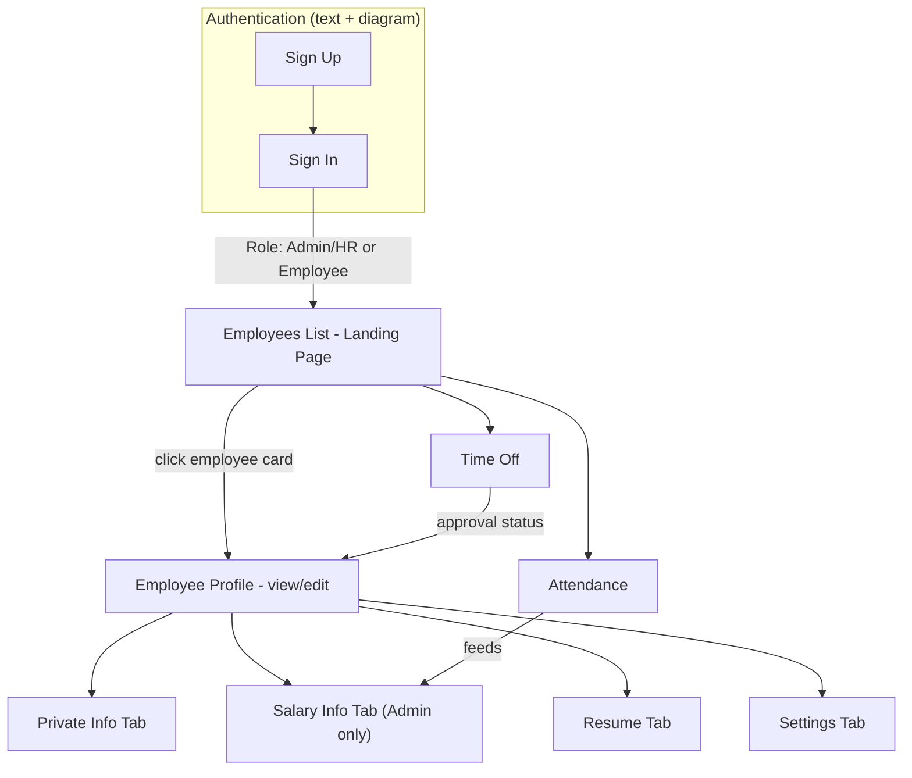

# Architecture.md — Technical Architecture
## Dayflow — Human Resource Management System (HRMS)

> **Important scope note:** The attached Excalidraw board is a set of **UI screen wireframes** (Sign Up, Sign In, Employees list, Employee Profile, Salary Info, Attendance, Time Off) with annotation callouts — it contains **no rectangles/shapes representing system components** (no Frontend/Backend/Database/API boxes) and **no directional data-flow arrows between such components**. The 20 arrows present in the file are all short annotation "callout" pointers connecting a note to a UI element, not architecture flow arrows. Per the accuracy rules, this document does not invent a technical architecture that isn't supported by the sources. Almost everything below is sourced from the **text description**, explicitly marked `Not specified` where neither source addresses it, and marked **Inference** where derived from UI structure rather than stated directly. **Layer/tab/screen structure implied by the wireframes is used for the Application Flow and System Components sections below, since that is the one thing the diagram does support.**

---

## Architecture Overview

Neither source specifies a technology stack, deployment topology, or backend/frontend split. What can be reconstructed is the **screen-level structure** implied by the wireframes and the **role-gated data flow** implied by the text.

*This diagram is an Inference built from the wireframe screens and tab labels plus the text's stated relationships (e.g., attendance feeding payroll, leave status reflecting on employee records). It is not a reproduction of a system architecture diagram, because no such diagram exists in the source file.*

---

## Technology Stack

| Layer | Technology | Purpose | Source |
|---|---|---|---|
| Frontend | Not specified | — | — |
| Backend | Not specified | — | — |
| Database | Not specified | — | — |
| Authentication | Not specified (mechanism only, no library/protocol named) | Sign Up / Sign In, role-based access | Text §3.1, Diagram (Sign Up/Sign In screens) |
| Hosting/Deployment | Not specified | — | — |

No technology names, frameworks, libraries, or vendor products are mentioned in either source. Do not assume any specific stack (e.g., do not assume this is built on Odoo, despite the diagram's Login ID example referencing "Odoo India" as a sample company name — see note under System Components → Authentication).

---

## Application Flow

Based on the text's functional requirements and the wireframes' screen order:

1. A user completes **Sign Up** (diagram: company name, logo, email, phone, password; text: Employee ID, email, password, role) or is provisioned by an Admin/HR (diagram-only path).
2. A user completes **Sign In** with Login ID/Email + Password; invalid credentials produce an error (text).
3. On success, the user lands on the **Employees list** page (diagram) — the text's separate "Dashboard" concept for this step is not reflected in the diagram (see Contradiction in `PRD.md`).
4. From the top navigation (Company Logo / Employees / Attendance / Time Off, present on every screen in the diagram) or the profile avatar dropdown (My Profile / Log Out), the user reaches:
   - Their own profile (editable, or Admin can edit any profile)
   - Another employee's profile (read-only, Admin/HR or self only for edit)
   - Attendance (own records for Employee; all employees for Admin/HR)
   - Time Off (own requests for Employee; all requests + approve/reject for Admin/HR)
5. Attendance records are used as an input to payroll's payable-days calculation (text §3.6 + diagram annotation).
6. Leave approvals/rejections update the employee's record "immediately" (text §3.5.2).

No request/response, client/server, or API call sequence is described in either source — the above is a **screen and role-based data-visibility flow**, not a network/API flow.

---

## System Components

Since the diagram contains no explicit system/technical components, this section lists the **application areas (screens/modules)** that both sources agree exist, with their responsibilities as stated.

### 1. Authentication Module
- **Responsibility:** Register/provision accounts, authenticate users, issue role-based sessions.
- **Inputs:** Sign Up fields (disputed between sources — see `PRD.md` Contradiction #1); Sign In: Login ID/Email + Password.
- **Outputs:** Authenticated session, redirect to landing page.
- **Dependencies:** None named (`Not specified` — no mention of a specific auth provider/protocol/token type).
- **Note on the Login ID format:** The diagram gives an explicit generation rule — `[Company Prefix][first 2 letters of first name][first 2 letters of last name][Year of Joining][Serial Number]`, with the worked example `OIJODO20220001` where "OI" stands for a sample company, "Odoo India." **Inference:** this is presented as a worked example of the *format*, not necessarily proof the system is built on or integrates with Odoo. Whether "Odoo India" refers to the actual company this HRMS is being built for, or is simply a placeholder/example, is `Not specified` — flagged for clarification.

### 2. Employees List Module
- **Responsibility:** Landing page after login; searchable directory of employees; per-employee status indicator (present/on leave/absent); entry point to view any employee's profile (read-only for non-owners).
- **Inputs:** Search query.
- **Outputs:** Filtered employee grid.
- **Dependencies:** Authentication (to know current user/role); Attendance/Time-Off modules (to derive the status icon shown on each card).

### 3. Employee Profile Module
- **Responsibility:** Store and display employee data across sub-sections: profile header, Resume, Private Info, Salary Info (Admin-gated), Settings/Security, and free-text bio sections (About, "What I love about my job," interests, Skills, Certifications).
- **Inputs:** Structured fields per `PRD.md` Feature 3.
- **Outputs:** Rendered profile (editable or read-only depending on viewer/owner).
- **Dependencies:** Authentication/role check (field-level: Salary Info visible to Admin only).

### 4. Attendance Module
- **Responsibility:** Record check-in/check-out; display day-wise attendance (Employee: own record, current-month default; Admin/HR: all employees, current day + monthly summaries); supply payable-days data to Payroll.
- **Inputs:** Check-in/check-out action (timestamp implied).
- **Outputs:** Attendance table rows (Date, Check In, Check Out, Work Hours, Extra Hours); summary counts (days present, leaves count, total working days).
- **Dependencies:** Authentication (scope of visible data); feeds Payroll module.

### 5. Time Off Module
- **Responsibility:** Display leave balances by type; accept leave requests; list and process approvals/rejections.
- **Inputs:** Leave request form (Time off Type, Validity Period, Allocation, optional Attachment); Approve/Reject action with optional comment (text only — the diagram's Time Off list shows Approve/Reject buttons but does not show a comment field explicitly).
- **Outputs:** Updated request status (Pending/Approved/Rejected); updated leave balance.
- **Dependencies:** Authentication (own vs. all-employee scope).

### 6. Payroll / Salary Module
- **Responsibility:** Define wage and auto-calculate salary components and deductions (Admin); present read-only payroll view (Employee).
- **Inputs:** Wage (Month/Yearly), working days/week, break time.
- **Outputs:** Basic Salary, HRA, Standard Allowance, Performance Bonus, LTA, Fixed Allowance, PF (Employer/Employee), Professional Tax.
- **Dependencies:** Attendance module (payable days); gated to Admin-only edit access.

---

## Folder Structure

Not specified. Neither source describes or implies a repository/folder layout, module boundaries in code, or file organization. No structure is proposed here, per the accuracy rules (a fabricated folder structure would not be traceable to either source).

---

## Data Architecture

No entity-relationship diagram, schema, or database technology is given in either source. Based only on the fields shown/described, the following **conceptual, non-binding** entities can be identified (labeled as Inference — field grouping only, not a designed schema):

- **User/Employee** — Login ID, Email, Password (hashed — not stated), Role, Name, Phone, Company, Department, Job Position, Manager, Location, Date of Birth, Residing Address, Nationality, Personal Email, Gender, Marital Status, Date of Joining
- **Bank Details** (likely related to User/Employee) — Account Number, Bank Name, IFSC Code, PAN No, UAN No, Emp Code
- **Salary Structure** (related to User/Employee) — Wage (amount, type), Working Days/Week, Break Time, Basic Salary, HRA, Standard Allowance, Performance Bonus, LTA, Fixed Allowance, PF Employer %, PF Employee %, Professional Tax
- **Attendance Record** (related to User/Employee) — Date, Check In, Check Out, Work Hours, Extra Hours, Status (Present/Absent/Half-day/Leave — text only)
- **Time Off Request** (related to User/Employee) — Type (Paid/Sick/Unpaid), Start Date, End Date, Allocation (days), Attachment, Remarks/Comments, Status (Pending/Approved/Rejected)
- **Time Off Balance** (related to User/Employee) — Type, Days Available

No relationships' cardinality, keys, indexes, or storage technology are specified — do not assume a relational vs. document store.

---

## API Architecture

Not specified. Neither source names any endpoint, API contract, or protocol (REST/GraphQL/etc.). No APIs are invented here.

---

## Authentication & Authorization

- **Mechanism:** Not specified beyond "Sign Up" / "Sign In" screens and a stated requirement for "secure authentication" and "role-based access" (text §1.2).
- **Session/token strategy:** Not specified.
- **Roles:** Admin/HR Officer and Employee (both sources agree).
- **Permissions (from both sources, reconciled):**
  - Employee: edit own limited profile fields (address, phone, photo); view own attendance; view/apply own leave; view own salary read-only; view others' profiles read-only via the Employees list.
  - Admin/HR Officer: edit any employee's full profile; view all attendance; view/approve/reject all leave requests; view and edit any employee's Salary Info (the diagram states this tab "should only be visible to Admin").
- **Protected resources:** Salary Info tab (Admin-only, explicit diagram annotation); all-employee Attendance/Time-Off views (Admin/HR-only, per text).
- **Authorization flow:** Not specified (no flow diagram or rule engine described — role check is inferred from the visibility statements above).

---

## External Integrations

None mentioned or drawn in either source. (Email verification is referenced in text §3.1.1, but no email service/provider is named.)

---

## Error/Data Flow

- Sign In: incorrect credentials → error message displayed (text §3.1.2). No further error-handling behavior (network errors, validation errors, timeouts) is specified anywhere in either source.

---

## Deployment Architecture

Not specified. No build process, environment (dev/staging/prod), hosting platform, or infrastructure is described in either source.

---

## Architectural Decisions

No architectural decisions or their reasoning are stated in either source (e.g., no reasoning is given for choosing "Fixed wage" as the only wage type, or for the specific PF/Professional Tax defaults). Where the diagram gives **worked example numbers** (e.g., Wage ₹50,000 → Basic ₹25,000), these are treated as illustrative examples of the calculation logic, not necessarily as fixed system defaults — this distinction is `Not specified` and should be clarified with stakeholders before implementation (i.e., confirm whether 50%/8.33%/12%/₹200 etc. are hardcoded defaults or admin-configurable rates).
