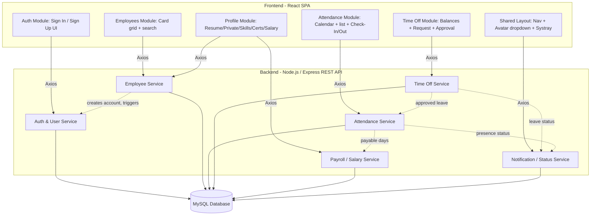

# Architecture.md — Technical Architecture

**Project:** Human Resource Management System (HRMS)

> Technology choices in this document follow the user's explicit stack request (React frontend, MySQL database designed in MySQL Workbench, Axios for API calls) plus additional technologies chosen to complete an end-to-end system where the source material only specified the *logical* architecture (see §"Suggested Technical Architecture (derived)" in `HRMS_Architecture.md`) and not concrete tech. Every stack choice below is marked **Source: Chosen** to distinguish it from anything stated in the project description.

---

## Architecture Overview

HRMS is a client-server web application:

- **Frontend:** React single-page application. Talks to the backend exclusively over HTTP via Axios.
- **Backend:** Node.js + Express REST API, organized by the six services named in the source's "Suggested Technical Architecture" section (Auth & User, Employee, Attendance, Time Off, Payroll/Salary, Notification/Status).
- **Database:** MySQL, schema designed/maintained in MySQL Workbench.
- **Auth:** JWT-based sessions issued by the Auth & User Service, role claim (`admin` / `employee`) checked on both frontend (UI gating) and backend (authorization middleware — the authoritative check).



This reproduces the module/service breakdown given verbatim in `HRMS_Architecture.md` §9 ("Suggested Technical Architecture (derived)"), and the directional data flows given in §6 ("Interconnections Between Panels" / "Key Data Flows"). No component or connection was invented beyond what those two sections state; the specific frontend/backend *technologies* filling each box are chosen (see Technology Stack table).

---

## Technology Stack

| Layer | Technology | Purpose | Source |
|---|---|---|---|
| Frontend framework | React (with React Router) | SPA UI, routing between Sign In, Employees Dashboard, Profile, Attendance, Time Off | Chosen (per user instruction) |
| Frontend state | React Context API + hooks (or Redux Toolkit for larger scope) | Auth/session state, role-based UI gating | Chosen |
| Styling | Tailwind CSS (or CSS Modules) | Card grid, tabs, forms described in the design | Chosen |
| HTTP client | Axios | All frontend → backend API calls | Chosen (per user instruction) |
| Backend runtime | Node.js | Server runtime | Chosen |
| Backend framework | Express.js | REST API routing, middleware (auth, role guard, validation) | Chosen |
| ORM | Sequelize | Maps the MySQL schema (designed in MySQL Workbench) to backend models; migrations | Chosen |
| Database | MySQL (schema authored in MySQL Workbench) | Persistent storage for employees, attendance, time off, salary, users | Chosen (per user instruction) |
| Auth | JWT (jsonwebtoken) + bcrypt | Session tokens; hashing the system-generated first-time password | Chosen — hashing mechanism itself is an **Inference** from the source's "password" generation requirement (§3.2), since no algorithm is named in the source |
| File storage | Local disk / cloud object storage (e.g., S3-compatible) for uploaded logos and sick-leave attachments | Storage for "Upload Logo" (Sign-Up) and "Attachment" (Time Off) fields named in the source | Chosen — the *need* for file upload is from the source; the storage mechanism is Chosen |
| API docs | OpenAPI/Swagger (swagger-jsdoc + swagger-ui-express) | Documents the REST endpoints for other AI agents/devs | Chosen |
| Validation | Joi or express-validator | Server-side validation of forms (employee creation, time-off request, etc.) | Chosen |
| Scheduling (optional) | node-cron | Monthly attendance aggregation / payable-days recompute jobs, if needed | Chosen — supports the "monthly summary" and "payable days" behavior described in the source (§5.3), exact trigger mechanism is `Not specified` in the source |
| Dev/DB tooling | MySQL Workbench | Schema design/ERD, used to produce the DDL consumed by Sequelize migrations | Chosen (per user instruction) |
| Testing | Jest + React Testing Library (frontend), Jest + Supertest (backend) | Unit/integration testing | Chosen |
| Deployment | `Not specified` in source; suggest containerized deployment (Docker) with separate frontend/backend/DB services | — | Chosen (proposed only) |

---

## Application Flow

Per the source's data flows (§6, "Key Data Flows"), a request moves through the system as follows:

1. **Employee Creation → Login:** Admin submits the "NEW employee" form (React) → Axios POST to Employee Service → Employee Service persists the record and calls Auth & User Service to generate Login ID + first-time password → credentials returned to Admin (and/or stored for the employee) → Employee signs in via Auth Module → Auth & User Service validates credentials, issues JWT → frontend redirects to Employees Dashboard.
2. **Card click → Profile:** Employees Module requests the card grid from Employee Service (with computed status from Attendance/Time Off, via Notification/Status Service or an aggregated endpoint) → user clicks a card → Profile Module requests the employee record from Employee Service → backend returns full record for Admin, a filtered/view-only-safe record for Employee role (server-side field filtering, since Salary Info must never reach a non-admin client).
3. **Systray Check-In/Check-Out → Attendance → Payroll:** Any page's systray widget calls Attendance Service (`POST /attendance/check-in`, `POST /attendance/check-out`) → Attendance Service writes the day's record and pushes a status update (via Notification/Status Service) so all open dashboard cards reflect it → Attendance Service aggregates monthly summaries on read → Payroll/Salary Service reads payable days (attendance − unpaid/missing days, adjusted by approved Time Off) when computing salary components.
4. **Time Off Request → Approval → Downstream Effects:** Employee submits a request (Time Off Module → Time Off Service) → Admin's Time Off view lists all pending requests → Admin approves/rejects → on approval, Time Off Service notifies Attendance Service (payable-days impact) and Notification/Status Service (✈️ icon on the employee's card).

---

## System Components

### Frontend Modules (from source §9)

| Component | Responsibility | Inputs | Outputs | Dependencies |
|---|---|---|---|---|
| Auth Module | Sign-in and Sign-up screens | Login ID/Email + Password (sign-in); Company/Name/Email/Phone/Password/Logo (sign-up) | JWT stored client-side; redirects | Auth & User Service |
| Shared Layout | Top nav, avatar dropdown (My Profile, Log Out), systray | Session state | Navigation events, Check-In/Out calls | Auth & User Service (logout), Attendance Service (systray) |
| Employees Module | Card grid + search + NEW button (Admin) | Search text; NEW button click | List of employee cards with status | Employee Service, Attendance Service, Time Off Service |
| Profile Module | Tabs: Resume, Private Info, Skills, Certs, Salary Info* | Form edits, tab selection | Updated profile record | Employee Service, Payroll/Salary Service (*Salary tab, Admin only) |
| Attendance Module | Calendar/list view + Check-In/Out trigger | Date navigation, check-in/out action | Day-wise rows, monthly summary | Attendance Service |
| Time Off Module | Balance cards, request form, Approve/Reject (Admin) | Request form fields; approve/reject action | Request list, updated balances | Time Off Service |

### Backend Services (from source §9)

| Component | Responsibility | Inputs | Outputs | Dependencies |
|---|---|---|---|---|
| Auth & User Service | Login ID generation, password hashing, login/session issuance | Employee identity fields (name, joining year), credentials | Login ID, hashed password, JWT | Employee Service (for Login ID inputs), MySQL |
| Employee Service | CRUD for employee profile data | Profile fields (identity, resume, private info, skills, certs) | Employee records; role-filtered views | MySQL, Auth & User Service |
| Attendance Service | Check-in/out capture, daily aggregation, payable-days input | Check-in/out timestamps | Day rows, monthly summary, payable-days figure | MySQL, Time Off Service (leave impact) |
| Time Off Service | Request creation, allocation management, approval workflow | Request fields, approve/reject actions | Request records with status, updated balances | MySQL, Attendance Service, Notification/Status Service |
| Payroll / Salary Service | Salary component computation, PF/Professional Tax deductions | Wage, working schedule, payable days | Computed salary components, payslip figures | Attendance Service, Employee Service, MySQL |
| Notification / Status Service | Real-time card status indicators (present/leave/absent) | Attendance + Time Off state changes | Status per employee for card rendering | Attendance Service, Time Off Service |

---

## Folder Structure

Not stated in the source. The following is a **proposed** structure only (not sourced from the description or diagram):

```
hrms/
├── frontend/                     # React app
│   ├── src/
│   │   ├── api/                  # Axios instance + per-module API functions
│   │   │   ├── axiosClient.js
│   │   │   ├── authApi.js
│   │   │   ├── employeeApi.js
│   │   │   ├── attendanceApi.js
│   │   │   ├── timeOffApi.js
│   │   │   └── payrollApi.js
│   │   ├── modules/
│   │   │   ├── auth/              # Sign In, Sign Up
│   │   │   ├── layout/            # Nav, Avatar dropdown, Systray
│   │   │   ├── employees/         # Card grid, search
│   │   │   ├── profile/           # Resume, Private Info, Skills, Certs, Salary
│   │   │   ├── attendance/        # Calendar, day-wise list, Admin all-employee view
│   │   │   └── timeoff/           # Balances, request form, approval list, allocation
│   │   ├── context/                # AuthContext / RoleContext
│   │   ├── routes/                 # Route guards (role-based)
│   │   ├── components/             # Shared UI (Card, Tabs, Modal, Table)
│   │   └── App.jsx
│   └── package.json
├── backend/                       # Node.js + Express API
│   ├── src/
│   │   ├── config/                 # DB config, env
│   │   ├── models/                 # Sequelize models (from MySQL Workbench schema)
│   │   ├── migrations/             # Sequelize migrations generated from Workbench DDL
│   │   ├── services/
│   │   │   ├── authService/
│   │   │   ├── employeeService/
│   │   │   ├── attendanceService/
│   │   │   ├── timeOffService/
│   │   │   ├── payrollService/
│   │   │   └── notificationService/
│   │   ├── routes/                 # Express routers per service
│   │   ├── middleware/             # authGuard, roleGuard, validation, errorHandler
│   │   └── app.js
│   └── package.json
├── database/
│   └── hrms_schema.mwb             # MySQL Workbench model file + exported .sql DDL
└── docs/
    ├── PRD.md
    ├── Architecture.md
    ├── Rules.md
    ├── Phases.md
    └── Design.md
```

---

## Data Architecture

Entities below are derived from fields explicitly listed in the source. Relationships are **Inference** (e1F) where the source describes association (e.g., "attendance feeds payslip") but not a formal schema.

### Entities

**User / Employee**
- login_id (generated, unique)
- first_name, last_name
- email, personal_email
- mobile
- company, department, manager, location
- role (`admin` | `employee`)
- password_hash
- date_of_birth, gender, nationality, marital_status
- residing_address
- bank_name, account_number, ifsc_code, pan_no, uan_no
- date_of_joining, job_position, emp_code
- about, job_love_text, hobbies_text (Resume/About free text)

**Skill** — employee_id (FK), skill_name
**Certification** — employee_id (FK), certification_name (fields beyond name `Not specified`)

**SalaryProfile** (Admin-managed, one per employee)
- employee_id (FK)
- wage_type (Fixed wage)
- wage_amount
- working_days_per_week
- basic_salary, hra, standard_allowance, performance_bonus, leave_travel_allowance, fixed_allowance
- professional_tax, pf_employee_contribution, pf_employer_contribution

**AttendanceRecord**
- employee_id (FK)
- date
- check_in_time, check_out_time
- work_hours, extra_hours, break_time

**TimeOffRequest**
- employee_id (FK)
- type (`Paid Time Off` | `Sick Leave` | `Unpaid Leaves`)
- start_date, end_date
- allocation_days
- attachment_url (nullable; used esp. for Sick Leave)
- status (`Pending` | `Approved` | `Rejected` — exact enum values are an **Inference** from "Approve/Reject" actions in the source)

**LeaveAllocation** (Admin-managed)
- employee_id (FK)
- type
- allocated_days
- remaining_days

### Relationships (Inference)
- One Employee → many AttendanceRecord (1:N)
- One Employee → many TimeOffRequest (1:N)
- One Employee → many LeaveAllocation (1:N, one per leave type)
- One Employee → one SalaryProfile (1:1)
- One Employee → many Skill, many Certification (1:N)

### Data Flow
Attendance + approved/unpaid TimeOffRequest → payable days (Attendance/Payroll Service) → consumed by SalaryProfile computation → Payslip. This is stated directly in the source (§6, Key Data Flow #3).

### Persistence & Validation
- MySQL is the system of record; schema authored/versioned in MySQL Workbench, exported as DDL, applied via Sequelize migrations.
- Server-side validation (role checks, required fields, date-range validity for Time Off, format checks like IFSC/PAN) is `Not specified` in the source in detail; enforcing it is a **Rule**, see `Rules.md`.

---

## API Architecture

No literal endpoint list is given in the source; the following REST surface is **proposed** to implement the stated capabilities. Mark all as **Chosen**, not sourced verbatim.

| Method | Endpoint | Service | Purpose |
|---|---|---|---|
| POST | `/api/auth/login` | Auth & User | Sign in with Login ID/Email + password |
| POST | `/api/auth/change-password` | Auth & User | Change password after first login |
| POST | `/api/employees` | Employee | Admin creates employee (triggers Login ID/password generation) |
| GET | `/api/employees` | Employee | Card grid list (search, status-enriched) |
| GET | `/api/employees/:id` | Employee | Get profile (role-filtered) |
| PUT | `/api/employees/:id` | Employee | Update profile (role-scoped field permissions) |
| GET | `/api/employees/:id/salary` | Payroll | Get Salary Info (Admin only) |
| PUT | `/api/employees/:id/salary` | Payroll | Update wage/components (Admin only) |
| POST | `/api/attendance/check-in` | Attendance | Systray check-in |
| POST | `/api/attendance/check-out` | Attendance | Systray check-out |
| GET | `/api/attendance/me` | Attendance | Own day-wise attendance, current month |
| GET | `/api/attendance/today` | Attendance | Admin: all employees present today, with filters |
| POST | `/api/timeoff` | Time Off | Submit a time-off request |
| GET | `/api/timeoff/me` | Time Off | Own time-off requests |
| GET | `/api/timeoff` | Time Off | Admin: all time-off requests |
| PATCH | `/api/timeoff/:id/approve` | Time Off | Admin approves |
| PATCH | `/api/timeoff/:id/reject` | Time Off | Admin rejects |
| GET/PUT | `/api/timeoff/allocations` | Time Off | Admin manages leave allocations |
| GET | `/api/status/:employeeId` | Notification/Status | Real-time card status (present/leave/absent) |

---

## Authentication & Authorization

- **Mechanism:** Login ID/Email + password sign-in (source §3.1); no self-registration for employees (source §3.2, business rule). **Chosen implementation:** JWT issued on login, sent as `Authorization: Bearer <token>` on subsequent Axios requests.
- **Session/token strategy:** `Not specified` in source (session vs. token not stated); **Chosen:** short-lived JWT access token, optional refresh token.
- **Roles:** `Admin / HR Officer` and `Employee`, exactly as named in the source's Access Matrix (§2).
- **Permissions:** Enforced per the Access Matrix in §2 of the source — e.g., only Admin/HR can create/edit employees, view Salary Info, view all Attendance/Time Off, approve/reject Time Off.
- **Protected resources:** Salary Info endpoints, employee-creation endpoint, all-employee Attendance/Time Off endpoints, approve/reject endpoints — all Admin/HR-only per the Access Matrix.
- **Authorization flow:** Frontend hides/shows UI by role (source's stated behavior — e.g., Salary tab "hidden" for Employee), but the backend **must** independently enforce role checks (Rule, since UI-only gating is insufficient — see `Rules.md`).

---

## External Integrations

None are named in the source. `Not specified`. (File storage for logo/attachment uploads is a **Chosen** implementation detail, not an external integration named by the source.)

---

## Error/Data Flow

Not described in the source beyond the business rule that unpaid leave / missing attendance "automatically" reduces payable days. Detailed error-handling behavior (HTTP error codes, retry, offline behavior) is `Not specified`; conventions to use are defined in `Rules.md`.

---

## Deployment Architecture

Not specified in the source. **Proposed (Chosen), not sourced:**
- Separate deployable units: `frontend` (static build served via Nginx/Vercel/etc.), `backend` (Node/Express, containerized), `MySQL` (managed instance or container).
- Environment variables for DB connection, JWT secret, file storage config.
- MySQL Workbench used at design-time only (not part of runtime deployment); its exported DDL is what ships.

---

## Architectural Decisions

| Decision | Reasoning | Source |
|---|---|---|
| Six backend services (Auth, Employee, Attendance, Time Off, Payroll, Notification) | Matches the "Suggested Technical Architecture (derived)" section verbatim | Source (explicitly given) |
| Role-based access is enforced both in UI and API | Source states Employee vs Admin visibility differences throughout (Access Matrix, hidden Salary tab, scoped Attendance/Time Off) | Source (Inference for "must enforce server-side," since the source only describes UI-level hiding) |
| Attendance is the system of record for payable days | Explicitly stated as a business rule (§8, item 6–7) | Source (explicitly given) |
| React + Node/Express + MySQL + Axios stack | Explicit user instruction for this documentation task | Chosen (user-directed) |
| Sequelize ORM bridging MySQL Workbench schema to backend | Needed to operationalize "MySQL Workbench" as the DB design tool while giving the backend a query/migration layer | Chosen |
