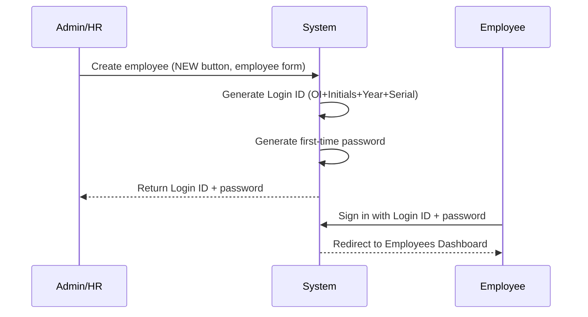
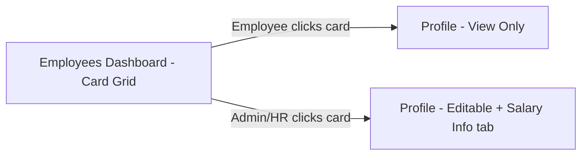
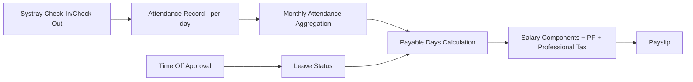
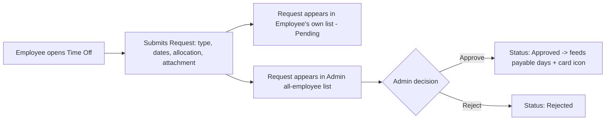

# PRD.md — Product Requirements Document

**Project:** Human Resource Management System (HRMS)
**Source documents:** `HRMS_Architecture.md` (project description, derived from an Excalidraw design titled *"Human Resource Management System - 8 hours"*).

> **Note on sources:** Only one source document was provided for this task (`HRMS_Architecture.md`). It states that it was itself generated from an Excalidraw diagram, but no separate Excalidraw image file was supplied to this session. All content below is therefore treated as coming from a single, already-reconciled text source. No text-vs-diagram contradictions could be checked because the raw diagram was not attached — see the **Final Quality Check** summary at the end of this response for details.

---

## Product Overview

**Product name:** Human Resource Management System (HRMS)

**One-paragraph description:** HRMS is a web/app-based platform that lets a company manage its employees end-to-end — from account creation, daily attendance and check-in/check-out, to time-off requests and approvals, to salary/payslip computation. Two roles exist: **Admin / HR Officer** (full control) and **Employee** (self-service, scoped visibility).

**Problem being solved:** Companies need a single system where HR can onboard employees (without self-registration), track daily presence, manage leave requests/approvals, and automatically compute payable salary based on attendance and approved leave — replacing manual/disconnected tracking of these processes.

**Product vision:** *Not specified* in the source beyond the operational description above.

**Product goals** (derived from source):
- Centralize employee profile, attendance, time-off, and salary data in one system.
- Give Admin/HR full administrative control while giving Employees safe, scoped self-service access.
- Make attendance the single source of truth that automatically drives payable-days and payslip calculation.

**Expected outcomes:** *Not specified* explicitly (e.g., no stated metrics/KPIs). **Inference:** reduced manual HR effort and fewer payroll errors, since attendance → payable days → salary is described as an automatic pipeline.

---

## Target Users

### 1. Admin / HR Officer
- **Who they are:** Company HR staff or administrators.
- **Goals:** Onboard employees, manage company data, review attendance, approve/reject time-off, manage salary and allocations.
- **Needs:** Full CRUD on employees, visibility into all employees' attendance and time-off, control over Salary Info.
- **Pain points:** *Not specified* explicitly; **Inference:** manual payroll/attendance reconciliation is the underlying pain point the system addresses.
- **Interaction:** Creates employee accounts (system auto-generates Login ID + first password), edits employee profiles fully, views/edits Salary Info, views all-employee attendance, approves/rejects time-off, manages leave allocations, uses Check-In/Check-Out like any user.

### 2. Employee (Normal User)
- **Who they are:** Regular company staff, cannot self-register.
- **Goals:** View and partially edit their own profile, check in/out, view their own attendance, request time off.
- **Needs:** Clear day-wise attendance view, simple time-off request flow, visibility of own leave balances.
- **Pain points:** *Not specified* explicitly.
- **Interaction:** Logs in with system-issued Login ID/password, views own profile (limited edit on About/Skills-type sections), views own day-wise attendance for the current month, creates time-off requests, cannot see Salary Info or other employees' Attendance/Time Off records.

No other personas are stated or diagrammed; no additional personas are inferred.

---

## User Stories

- As an **Admin/HR Officer**, I want to create a new employee account, so that the employee can log in without self-registering.
- As an **Admin/HR Officer**, I want the system to auto-generate a Login ID and first-time password, so that I don't have to assign credentials manually.
- As an **Employee**, I want to log in and change my system-generated password, so that my account is secure.
- As an **Employee**, I want to view my own profile (Resume, Private Info, Skills, Certification), so that I can review and update my information.
- As an **Employee**, I want to edit limited sections of my profile (About, skills, etc.), so that I can keep my public info current.
- As an **Admin/HR Officer**, I want full edit access to any employee's profile, so that I can maintain accurate records.
- As an **Admin/HR Officer**, I want to view and edit an employee's Salary Info tab, so that I can manage compensation.
- As any **user**, I want to see a grid of employee cards with status indicators, so that I can quickly see who is present, on leave, or absent.
- As any **user**, I want to click an employee card to open their profile, so that I can view details (view-only for non-admins).
- As any **user**, I want to check in and check out from a systray control on any page, so that my attendance is recorded without navigating away.
- As an **Employee**, I want to see my own day-wise attendance for the current month, so that I can track my work hours.
- As an **Admin/HR Officer**, I want to see all employees' attendance for the current day (with filters), so that I can monitor presence.
- As an **Employee**, I want to submit a time-off request (type, dates, allocation, attachment for sick leave), so that I can request leave.
- As an **Employee**, I want to see only my own time-off records, so that my requests are private from other employees.
- As an **Admin/HR Officer**, I want to view all employees' time-off requests and approve or reject them, so that I can manage leave centrally.
- As an **Admin/HR Officer**, I want to manage leave allocations per employee/type, so that balances stay accurate.
- As the **system**, payable days should be calculated from attendance and approved/unpaid leave, so that salary computation is accurate. *(Inference: phrased as a system behavior implied by the "Business Rules" section, not a literal user story in the source.)*

---

## Core Features

### 1. Authentication & Onboarding
- **Purpose:** Control who can access the system and how accounts are created.
- **Description:** Sign-in page (Login ID/Email + Password). Sign-up page exists in the UI but employees cannot complete self-registration; accounts are created only by Admin/HR, who triggers auto-generation of a Login ID (format `[OI][First2FirstName][First2LastName][YearOfJoining][4-digit serial]`, e.g. `OIJODO20220001`) and a first-time password.
- **User value:** Secure, controlled onboarding; no unauthorized self-signup.
- **Functional behavior:** Admin submits employee creation form → system generates Login ID + password → employee can log in and (may) change the password.
- **Inputs:** Company Name, Name, Email, Phone, Password, Confirm Password, Upload Logo (Sign-Up form fields as designed — **Note:** the Sign-Up form as designed collects company-level fields; how this reconciles with "employees cannot self-register" is flagged below in Contradictions/Ambiguities).
- **Outputs:** Authenticated session; generated Login ID and first-time password.
- **Dependencies:** Employee Service (for Login ID generation), password hashing.
- **Edge cases:** Duplicate name-initials in the same joining year (serial number increments — exact collision-handling logic is `Not specified`); forced vs. optional password change is `Not specified` ("forced / allowed to change the password").
- **Acceptance criteria:** An Admin-created employee can log in using the generated Login ID and first-time password; a normal user cannot complete account creation from the Sign-Up screen.

### 2. Employees Dashboard (Card Grid)
- **Purpose:** Landing page after login; browse and open employee records.
- **Description:** Header with search bar and a **NEW** button (Admin/HR only). Grid of employee cards, each showing profile picture, name, basic info, and a status indicator (🟢 present, ✈️ on leave, 🟡 absent).
- **User value:** Quick visual overview of the workforce and fast access to any profile.
- **Functional behavior:** Cards are clickable → opens the employee's profile (view-only for Employees, editable + Salary tab for Admin/HR).
- **Inputs:** Search query; NEW button (Admin/HR) to create an employee.
- **Outputs:** Filtered card grid; navigation to profile.
- **Dependencies:** Employee Service, Attendance Service (for status icon), Time Off Service (for leave/airplane icon).
- **Edge cases:** *Not specified* (e.g., behavior with zero search results).
- **Acceptance criteria:** All employees render as cards with an accurate, real-time status icon; clicking a card opens the correct profile in the correct mode for the current role.

### 3. My Profile / Employee Profile
- **Purpose:** Store and display employee identity, resume-style info, private info, skills, certifications, and (Admin-only) salary.
- **Description:** Header block (photo, name, Login ID, email, mobile, company, department, manager, location) plus tabs: Resume, Private Info, Skills, Certification, Salary Info (Admin only).
- **User value:** Single place for all employee-related data.
- **Functional behavior:** Employee can edit limited sections (About, "What I love about my job", "My interests and hobbies", Skills, Certification add). Admin has full edit control on any profile, including Salary Info.
- **Inputs:** Free-text fields (About, job-love, hobbies); Private Info form fields (DOB, Gender, Nationality, Marital Status, Personal Email, Residing Address, Bank Name, Account Number, IFSC Code, PAN No, UAN No, Date of Joining, Job Position, Emp Code); Skills list; Certification list.
- **Outputs:** Persisted employee profile record.
- **Dependencies:** Employee Service.
- **Edge cases:** *Not specified* (e.g., field validation rules for PAN/IFSC format are not detailed).
- **Acceptance criteria:** Employee cannot see or edit Salary Info; Employee edits are restricted to the stated limited sections; Admin can view/edit all sections including Salary Info.

### 4. Salary Info (Admin only)
- **Purpose:** Define wage and compute salary components/deductions per employee.
- **Description:** Wage Type (Fixed wage), Working Schedule (days/week), auto-calculated Salary Components (Basic Salary, HRA, Standard Allowance, Performance Bonus, Leave Travel Allowance, Fixed Allowance), Tax Deductions (Professional Tax, Provident Fund — employee & employer contribution), and Month/Yearly Wage display (₹/month, optional hourly rate).
- **User value:** Automates payroll component calculation from a single wage input.
- **Functional behavior (computation rules as stated):**
  - Basic Salary = % of wage/company cost (example: 50% → 25000)
  - House Rent Allowance = 50% of Basic (example: 12500)
  - Standard Allowance = Fixed amount (example: 4167)
  - Performance Bonus = % of Basic (example: 8.33%)
  - Leave Travel Allowance = % of Basic (example: 8.33%)
  - Fixed Allowance = Wage − sum of all other components
  - Professional Tax deducted from Gross
  - Provident Fund calculated on Basic Salary (employee + employer contribution, exact % `Not specified`)
- **Inputs:** Wage amount, working days/week, applicable percentages.
- **Outputs:** Computed salary component breakdown; payslip figures.
- **Dependencies:** Attendance Service (payable days), Employee Service.
- **Edge cases:** Exact PF percentage, Professional Tax slab/amount, and rounding rules are `Not specified`.
- **Acceptance criteria:** Given a wage and the stated percentages, the system computes all listed components and deductions consistently with the formulas above.

### 5. Attendance
- **Purpose:** Track daily presence and working hours; feed payroll.
- **Description:** Employee view shows own day-wise attendance for the current month (date navigation, summary cards: days present, leaves count, total working days; per-day: Date, Day, Check In, Check Out, Work Hours, Extra hours, Break Time). Admin/HR view shows all employees present on the current day with filters and date navigation. Check-In/Check-Out available via systray from any page; status indicator flips red → green on successful check-in, with a running "Since HH:MMPM" timer.
- **User value:** Accurate, low-friction time tracking that automatically informs payroll.
- **Functional behavior:** Attendance is the basis for payable-days calculation; unpaid leave or missing attendance automatically reduces payable days.
- **Inputs:** Check-In/Check-Out action (timestamp).
- **Outputs:** Per-day attendance record; aggregated monthly summary; payable-days figure for payroll.
- **Dependencies:** Time Off Service (approved leave affects payable days), Payroll/Salary Service (consumes payable days).
- **Edge cases:** Break-time capture mechanism is `Not specified`; multiple check-in/out per day is `Not specified`.
- **Acceptance criteria:** A completed check-in/check-out pair produces a correct Work Hours value for that day; monthly summary counts match the underlying day rows; payable days correctly subtract unpaid/missing days.

### 6. Time Off
- **Purpose:** Request, allocate, and approve/reject leave.
- **Description:** Leave Balance Cards (e.g., Paid Time Off 24 days, Sick Time Off 7 days). List/table of requests (Name, Start Date, End Date, Type, Status). Employees see and create only their own requests. Admin/HR see all requests, with Approve/Reject actions, plus an Allocation tab to manage balances per employee/type.
- **User value:** Structured, auditable leave workflow with clear balances.
- **Functional behavior:** Request form: Employee (pre-filled or selectable for Admin), Time Off Type (Paid Time Off / Sick Leave / Unpaid Leaves), Validity Period (start–end), Allocation (e.g., 1.00 Days), Attachment (esp. for Sick Leave), Submit/Discard. Approval updates leave status (reflected as the airplane icon on the Employees dashboard) and feeds payable-days calculation.
- **Inputs:** Type, date range, allocation amount, optional attachment.
- **Outputs:** Time-off request record with status (e.g., pending/approved/rejected — exact status values `Not specified` beyond "Approve/Reject" actions).
- **Dependencies:** Employee Service, Attendance/Payroll (payable days).
- **Edge cases:** Overlapping requests, partial-day requests, and balance-exceeding requests are `Not specified`.
- **Acceptance criteria:** Employee can submit a request that appears in their own list with correct type/dates; Admin can approve/reject and the resulting status is reflected on the Employees dashboard status icon and in payable-days calculation.

---

## Functional Requirements

- **FR-001:** The system shall prevent employees from completing self-registration/sign-up.
- **FR-002:** The system shall allow Admin/HR to create employee accounts.
- **FR-003:** The system shall auto-generate a Login ID using the format `[OI][First2FirstName][First2LastName][YearOfJoining][4-digit serial]`.
- **FR-004:** The system shall auto-generate a first-time password for each newly created employee.
- **FR-005:** The system shall allow an employee to log in with the Login ID/Email and password.
- **FR-006:** The system shall allow a logged-in employee to change their password.
- **FR-007:** The system shall display an Employees dashboard as the post-login landing page, showing employee cards in a grid.
- **FR-008:** The system shall show a real-time status indicator (present / on leave / absent) on each employee card.
- **FR-009:** The system shall allow searching the Employees dashboard.
- **FR-010:** The system shall allow Admin/HR to open an employee creation form via a "NEW" button.
- **FR-011:** The system shall open an employee's profile in view-only mode when a non-admin clicks a card.
- **FR-012:** The system shall open an employee's profile in editable mode, including Salary Info, when Admin/HR clicks a card or opens "My Profile"/an employee record.
- **FR-013:** The system shall restrict the Salary Info tab to Admin/HR only.
- **FR-014:** The system shall let employees edit only specific profile sections (About, "what I love about my job," interests/hobbies, Skills, Certification) while Admin/HR can edit all sections.
- **FR-015:** The system shall calculate salary components (Basic, HRA, Standard Allowance, Performance Bonus, Leave Travel Allowance, Fixed Allowance) from a defined wage, per the stated formulas.
- **FR-016:** The system shall calculate Professional Tax and Provident Fund deductions (employee and employer contributions).
- **FR-017:** The system shall record Check-In and Check-Out timestamps from a systray control available on any page.
- **FR-018:** The system shall flip the status indicator from red to green on successful check-in and show an elapsed-time timer.
- **FR-019:** The system shall show an employee their own day-wise attendance for the current month, with a monthly summary (days present, leaves, total working days).
- **FR-020:** The system shall show Admin/HR the attendance of all employees present on the current day, with filters.
- **FR-021:** The system shall compute payable days from attendance records, automatically reducing payable days for unpaid leave or missing attendance.
- **FR-022:** The system shall let employees create time-off requests specifying type, date range, allocation, and (for sick leave) an attachment.
- **FR-023:** The system shall restrict an employee's Time Off view to their own requests.
- **FR-024:** The system shall let Admin/HR view all employees' time-off requests and approve or reject them.
- **FR-025:** The system shall let Admin/HR manage leave allocations per employee and type.
- **FR-026:** The system shall display leave balance cards (e.g., Paid Time Off, Sick Time Off) with remaining days available.
- **FR-027:** The system shall reflect approved time-off as an updated status icon (✈️) on the relevant employee's card.

---

## Non-Functional Requirements

| Category | Requirement |
|---|---|
| Performance | `Not specified` |
| Security | Role-based access control (Admin/HR vs Employee) is explicitly required; password hashing is implied by "auto-generated first-time password" handling but hashing algorithm is `Not specified`. |
| Scalability | `Not specified` |
| Reliability | `Not specified` |
| Accessibility | `Not specified` |
| Maintainability | `Not specified` |
| Availability | `Not specified` |
| Data integrity | Payable-days/payroll figures must derive consistently from Attendance + Time Off (**stated as a business rule**, treated here as a data-integrity requirement). |
| Privacy | Employee Time Off and Attendance visibility is strictly scoped to "own records" vs. "all records" by role (**stated rule**). |
| Compatibility | Described as "web/app-based" — specific browsers/devices `Not specified`. |

---

## User Flows

### Flow 1 — Employee onboarding and first login

### Flow 2 — Card click → profile view (role-scoped)

### Flow 3 — Attendance to payroll

### Flow 4 — Time-off request and approval

These four flows are directly supported by the source's "Interconnections Between Panels" and "Key Data Flows" sections; no additional flows were invented.

---

## Acceptance Criteria

- **Authentication:** An employee cannot reach an authenticated area via self-registration; an Admin-created account can log in with its generated credentials.
- **Employees Dashboard:** Status icons match the underlying attendance/leave state; card click routes to the correct profile mode by role.
- **Profile:** Non-admin edits are limited to the stated sections; Salary Info is inaccessible to non-admins in the UI and (by extension) must be enforced server-side.
- **Salary Info:** Component values follow the stated formulas for a given wage input.
- **Attendance:** Check-in/out via systray updates the record and the live status indicator; monthly summary reflects the day rows; payable days reduce correctly for unpaid/missing days.
- **Time Off:** Employees see only their own requests; Admin sees all and can approve/reject; approved leave updates payable days and the card status icon.

---

## Scope

**In Scope** (explicitly described and diagrammed):
- Authentication (sign-in; sign-up screen exists but is not a functional self-registration path for employees)
- Admin-driven employee creation with auto-generated Login ID/password
- Employees dashboard (card grid, search, status icons)
- My Profile / Employee Profile (Resume, Private Info, Skills, Certification, Salary Info)
- Attendance (Check-In/Check-Out, day-wise employee view, Admin all-employee current-day view)
- Time Off (request, own/all views, Approve/Reject, Allocation management, balance cards)
- Salary/payslip component computation from attendance-driven payable days

**Out of Scope:** `Not specified` — the source does not explicitly list exclusions.

**Future / Planned:** `Not specified` — no roadmap items beyond the above are stated. **Inference:** forced password change on first login is *implied as possible* ("forced / allowed to change the password") but not committed to either behavior.
