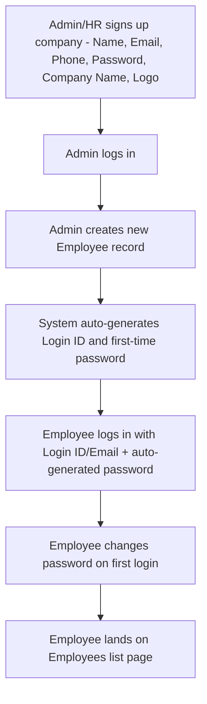
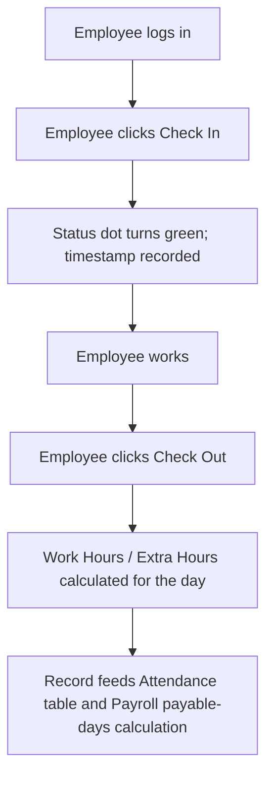
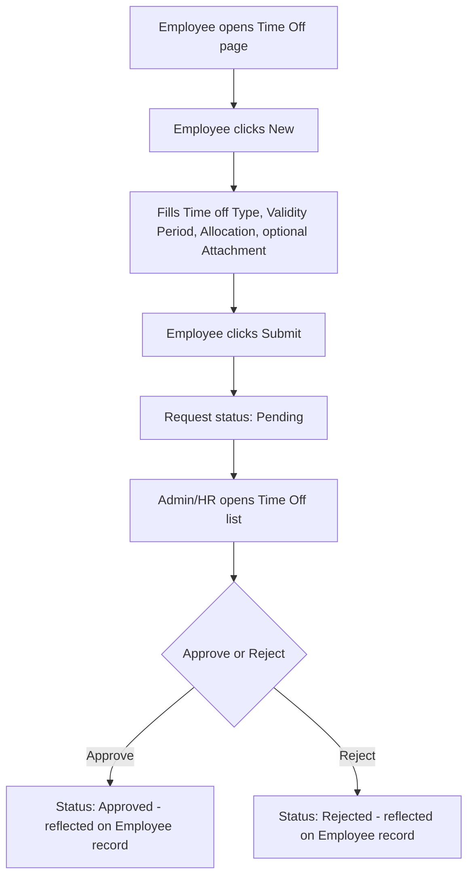
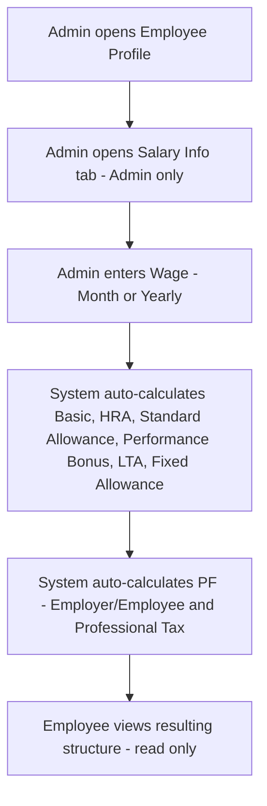

# PRD.md — Product Requirements Document
## Dayflow — Human Resource Management System (HRMS)

> Source note: This document reconciles two sources — (1) the written project description ("Dayflow" HRMS spec), and (2) an Excalidraw board of **UI screen wireframes** (Sign Up, Sign In, Employees list, Employee Profile, Salary Info, Attendance, Time Off) with annotation callouts. The Excalidraw board is **not** a system/technical architecture diagram — it contains no frontend/backend/database boxes or data-flow arrows. All architecture-level content in `Architecture.md` is therefore drawn almost entirely from the text description, and is marked accordingly. See `Architecture.md` and the Final Quality Check at the end of this doc-set summary for a full list of contradictions found between the two sources.

---

## Product Overview

**Product name:** Dayflow (tagline: *"Every workday, perfectly aligned."*) — a Human Resource Management System (HRMS).

**Description:** Dayflow digitizes and streamlines core HR operations: employee onboarding, profile management, attendance tracking, leave/time-off management, payroll (salary) visibility, and approval workflows for Admins/HR Officers, for two user roles — Admin/HR Officer and Employee.

**Problem being solved:** Manual/fragmented handling of HR operations (attendance, leave requests, payroll visibility, approvals) across a company.

**Product vision:** *Not specified* beyond the tagline "Every workday, perfectly aligned."

**Product goals:**
- Provide secure, role-based authentication.
- Centralize employee profile data (personal, job, salary, documents).
- Digitize attendance tracking (daily/weekly).
- Digitize leave/time-off requests and approvals.
- Give employees read-only payroll visibility and give Admins full payroll control.

**Expected outcomes:** *Not specified* in either source (no explicit success metrics/KPIs given).

---

## Target Users

### Admin / HR Officer
- **Description (text):** Manages employees, approves leave & attendance, views payroll details.
- **Diagram evidence:** Sees the full Employees list, all employees' Attendance for the current day, Approve/Reject buttons on the Time Off list, and an Admin-only "Salary Info" tab on an employee's profile (annotated *"Salary Info tab Should only be visible to Admin"*) with full editing rights over wage/salary components.
- **Diagram-only detail (Inference labeled in source as a fixed workflow, not a persona label):** Admin/HR is also responsible for **creating employee accounts** — per an annotation, normal employees cannot self-register; the Admin/HR creates each employee's login, and the system auto-generates both the Login ID and a first-time password.

### Employee
- **Description (text):** Views personal profile, attendance, applies for leave, views salary details (read-only).
- **Diagram evidence:** Sees only their own attendance, only their own Time Off requests/balances, a read-only "Salary Info" that is otherwise hidden from them (per the Admin-only annotation), and profile sections (Resume, Private Info, About, Skills, Certifications) they can partially edit.

No other personas are described or drawn. *(No "Super Admin", "Manager-only", or "Payroll Officer" persona appears in either source — do not assume one.)*

---

## User Stories

- As an **Employee**, I want to check in and check out, so that my attendance is recorded automatically.
- As an **Employee**, I want to view my daily/weekly/monthly attendance, so that I can confirm it is accurate.
- As an **Employee**, I want to apply for leave (choosing a leave type and date range, with optional remarks/attachment), so that I can request time off.
- As an **Employee**, I want to view my leave balances (e.g., Paid Time Off, Sick Time Off) and the status of my requests (Pending/Approved/Rejected), so that I know where I stand.
- As an **Employee**, I want to view my salary structure and payroll (read-only), so that I understand my compensation.
- As an **Employee**, I want to edit limited profile fields (address, phone, profile picture), so that my details stay current.
- As an **Admin/HR Officer**, I want to view the list of all employees with their current status, so that I can get a quick overview of who is present/absent/on leave.
- As an **Admin/HR Officer**, I want to view and edit any employee's full profile, so that I can maintain accurate records.
- As an **Admin/HR Officer**, I want to view all employees' attendance for the current day, so that I can monitor the workforce.
- As an **Admin/HR Officer**, I want to view, approve, or reject leave requests (with comments), so that I can manage time off across the company.
- As an **Admin/HR Officer**, I want to define and update an employee's salary structure (wage, components, deductions), so that payroll stays accurate.
- As an **Admin/HR Officer**, I want to create new employee accounts (with an auto-generated Login ID and first-time password), so that employees don't need to self-register. *(Diagram-only; see Contradiction #1 below.)*
- As a **new user setting up the company**, I want to sign up with a company name and logo, so that I can start using Dayflow for my organization. *(Diagram-only; see Contradiction #1 below.)*

---

## Core Features

### 1. Authentication & Authorization
- **Purpose:** Secure access, separated by role.
- **Description:** Sign Up and Sign In flows; role-based access (Admin vs Employee).
- **Inputs (per text):** Employee ID, Email, Password, Role (Employee/HR) at sign-up; Email + Password at sign-in.
- **Inputs (per diagram — Sign Up screen):** Name, Email, Phone, Password, Confirm Password, Company Name, Upload Logo. **(Contradiction — see below.)**
- **Inputs (per diagram — Sign In screen):** Login ID/Email, Password.
- **Outputs:** Authenticated session; redirect to landing page.
- **Dependencies:** Email verification (text only — not shown in diagram). Password security rules (text only — specific rules not specified in either source; `Not specified`).
- **Edge cases:** Incorrect credentials → error message (text). No password-reset flow is described or drawn in either source (`Not specified`).
- **Acceptance criteria:** A user can register/be provisioned, log in with valid credentials, and is denied login with invalid credentials with a visible error message.

> **Contradiction (Text vs. Diagram):** The text (§3.1.1) describes **employee self-registration** with Employee ID/Email/Password/Role. The diagram's Sign Up screen instead collects **Name, Email, Phone, Password, Confirm Password, Company Name, and a company Logo upload** — consistent with an *organization/admin* sign-up, not an individual employee sign-up. A diagram annotation explicitly states: *"Normal user cannot register, so when the HR officer or Admin creates a new user/employee, their ID should also be created with this method. Their password should be auto-generated for the first time by the system. They can login and change the system-generated password."* This directly contradicts the text's implication that employees self-register. **This is flagged, not resolved — an implementer must clarify which behavior is correct**, but the diagram's explicit annotation is treated as the more detailed/authoritative source for the registration *mechanism*, while the text is followed for the general presence of a "Sign Up" capability.

> **Diagram-only detail:** Login IDs are auto-generated in the format `[OI][first two letters of first name + first two letters of last name][year of joining][serial number of joining]`, e.g. `OIJODO20220001` (where "OI" = company-name-derived prefix, shown in the annotation as "Odoo India"). **Inference:** the literal prefix "OI" appears to be sourced from a specific reference company name; whether the prefix is configurable per company is `Not specified`.

### 2. Landing Page After Login
- **Diagram evidence:** An annotation explicitly states *"After login the user must land on this page"* next to the **Employees (list) page**, not a "Dashboard."
- **Description:** Top navigation bar (Company Logo, Employees, Attendance, Time Off) + a searchable grid of employee cards. Each card shows the employee's profile picture, basic info, and a status icon in the top-right corner:
  - 🟢 Green dot = present in the office
  - ✈️ Airplane icon = on leave
  - 🟡 Yellow dot = absent (no time-off applied, not present)
- Cards are clickable and open the selected employee's profile in a **view-only (non-editable)** mode.

> **Contradiction (Text vs. Diagram):** The text (§3.2) describes a dedicated **"Dashboard"** for both roles — an Employee Dashboard with quick-access cards (Profile, Attendance, Leave Requests, Logout) and an Admin/HR Dashboard (Employee list, Attendance records, Leave approvals). **No such Dashboard screen appears anywhere in the diagram.** Instead, the diagram's landing screen is the Employees list page described above, and the functions the text assigns to a "Dashboard" (viewing the employee list, attendance, leave) are instead reached via the top navigation bar and the profile avatar dropdown (My Profile, Log Out). This is flagged as an unresolved contradiction.

### 3. Employee Profile Management
- **Purpose:** Central record of employee data.
- **Description:** Profile header (photo, Name, Job Position, Email, Mobile, Company, Department, Manager, Location, Login ID) plus tabs/sections:
  - **Resume** (label present in diagram; content `Not specified`)
  - **Private Info**: Date of Birth, Residing Address, Nationality, Personal Email, Gender, Marital Status, Bank Details (Account Number, Bank Name, IFSC Code, PAN No, UAN No, Emp Code, Date of Joining)
  - **Salary Info** — visible to Admin only (annotated explicitly); see Feature 5.
  - **Settings** → Security (content `Not specified` beyond the label)
  - About/bio, "What I love about my job," "My interests and hobbies" (free-text sections), Skills, "+ Add Skills", Certification
- **User value:** Employees maintain accurate personal records; Admin/HR maintain full company records.
- **Inputs:** Free text/structured fields as listed above.
- **Outputs:** Rendered profile view (editable for the owner/Admin; read-only for others viewing via the Employees list).
- **Dependencies:** Authentication/role check (to gate Salary Info and edit rights).
- **Edge cases:** *Not specified* (e.g., no validation rules for bank details/PAN/IFSC format are given in either source).
- **Acceptance criteria:** An Employee can view their own full profile and edit address/phone/profile picture; an Admin can view and edit all fields for any employee; a non-owner Employee viewing another profile via the Employees list sees a read-only view.

### 4. Attendance Management
- **Purpose:** Track and view attendance.
- **Description (text):** Daily/weekly views; check-in/check-out; statuses: Present, Absent, Half-day, Leave.
- **Description (diagram):**
  - **Employee view:** Check In / Check Out systray control (a status dot that is red before check-in and turns green after a successful check-in, per annotation). Day-wise attendance table for the current month by default: Date, Check In, Check Out, Work Hours, Extra Hours, with prev/next date navigation.
  - **Admin/HR view:** Shows all employees present on the current day, month navigation, and summary widgets: "Count of days present," "Leaves count," "Total working days."
- **Diagram-only detail:** *"Attendance data serves as the basis for payslip generation... Any unpaid leave or missing attendance days should automatically reduce the number of payable days during payslip computation."* This links Attendance directly to Payroll — a dependency not stated explicitly in the text.
- **Dependencies:** Authentication (own vs. all-employee view); feeds Payroll computation.
- **Edge cases:** `Not specified` (e.g., missed check-out, late check-in penalties are not defined).
- **Acceptance criteria:** An Employee sees only their own attendance; Admin/HR sees all employees' attendance; check-in/check-out updates the record and the status indicator in real time.

### 5. Leave & Time-Off Management
- **Purpose:** Request and approve time off.
- **Description (text):** Employees select leave type (Paid/Sick/Unpaid), a date range, and remarks; status is Pending/Approved/Rejected. Admin/HR views all requests, approves/rejects with comments; changes reflect immediately.
- **Description (diagram):**
  - **Employee view:** Summary cards per leave type (e.g., "Paid Time Off — 24 Days Available," "Sick Time Off — 07 Days Available"), a "New" request button opening a form: Employee (auto-filled), Time off Type (dropdown: Paid Time Off / Sick Leave / Unpaid Leaves), Validity Period (date range), Allocation (number of days), Attachment (annotated *"For sick leave certificate"*), Submit/Discard buttons.
  - **Admin/HR view:** Same summary cards plus a searchable list/table of all requests: Name, Start Date, End Date, Time off Type, Status, with Approve/Reject buttons.
- **User value:** Self-service leave requests; centralized approval for Admin/HR.
- **Dependencies:** Authentication (own vs. all-employee scope); leave balance must be tracked to display "days available."
- **Edge cases:** `Not specified` (e.g., what happens if requested days exceed the available balance is not defined in either source).
- **Acceptance criteria:** An Employee can submit a leave request with a type, date range, and optional attachment, and see it appear as Pending; an Admin can see it in the list and Approve/Reject it with the status reflected immediately for the Employee.

### 6. Payroll / Salary Management
- **Purpose:** Manage and display compensation.
- **Description (text):** Employee payroll view is read-only; Admin can view all payroll, update salary structure, and ensure payroll accuracy.
- **Description (diagram — Admin-only "Salary Info" tab):**
  - **Wage Type:** Fixed wage, entered as Month Wage / Yearly Wage.
  - Additional fields: No. of working days per week, Break Time.
  - **Salary Components** (auto-calculated from Wage, each with a computation type of Fixed Amount or Percentage of Wage):
    - Basic Salary — percentage of Wage (worked example: 50% of ₹50,000 = ₹25,000)
    - House Rent Allowance (HRA) — percentage of Basic (worked example: 50% of Basic = ₹12,500)
    - Standard Allowance — fixed amount (worked example: ₹4,167/month)
    - Performance Bonus — percentage of Basic (worked example: 8.33%)
    - Leave Travel Allowance (LTA) — percentage of Basic (worked example: 8.33%)
    - Fixed Allowance — remainder: Wage minus the total of all other components
  - **Constraint (diagram-only):** "Salary component values should auto-update when the wage amount changes. The total of all components should not exceed the defined Wage."
  - **Tax Deductions:**
    - Provident Fund (PF) — Employer 12% and Employee 12%, each calculated on Basic Salary (worked example: ₹3,000)
    - Professional Tax — fixed ₹200/month
- **User value:** Automates payroll math from a single wage input; gives Admin fine control, gives Employees transparent (read-only) visibility.
- **Dependencies:** Attendance data (payable days), Basic Salary (drives HRA, PF, bonuses).
- **Edge cases:** `Not specified` (e.g., mid-cycle wage changes, prorated first/last month).
- **Acceptance criteria:** Given a Wage value, all salary components and deductions calculate automatically per the percentages/fixed amounts above, and the Employee sees the resulting structure read-only.

---

## Functional Requirements

- **FR-001:** The system shall provide a Sign Up flow that collects at minimum: name/company identity, email, password, and (per diagram) company name and logo for initial account creation.
- **FR-002:** The system shall provide a Sign In flow using Login ID/Email and Password, and display an error message on invalid credentials.
- **FR-003:** The system shall auto-generate a unique Login ID for each employee account in the format `[Company Prefix][First 2 letters of first name][First 2 letters of last name][Year of Joining][Serial Number]`. *(Diagram-only.)*
- **FR-004:** The system shall auto-generate a first-time password for employee accounts created by Admin/HR, and allow the employee to change it after first login. *(Diagram-only.)*
- **FR-005:** The system shall enforce role-based access such that only Admin/HR Officer can view/edit the "Salary Info" tab of any employee profile.
- **FR-006:** The system shall display, immediately after login, a searchable list of employees with each employee's profile photo and a current attendance/leave status indicator (present / on leave / absent).
- **FR-007:** The system shall allow Employees to view their own full profile and edit their address, phone number, and profile picture.
- **FR-008:** The system shall allow Admin/HR to view and edit all fields of any employee's profile.
- **FR-009:** The system shall allow a non-owner viewer to open another employee's profile in a read-only (view-only) mode by clicking their card in the Employees list.
- **FR-010:** The system shall provide a Check In / Check Out control for Employees that records timestamps and updates a visual status indicator.
- **FR-011:** The system shall display an Employee's own day-wise attendance (Date, Check In, Check Out, Work Hours, Extra Hours) for the current month by default, with navigation between dates/months.
- **FR-012:** The system shall allow Admin/HR to view the attendance of all employees for the current day, plus summary counts (days present, leaves taken, total working days) for a selectable month.
- **FR-013:** The system shall use recorded attendance (including unpaid leave and missing attendance) to reduce payable days in payroll computation. *(Diagram-only.)*
- **FR-014:** The system shall allow Employees to view their leave balances by type (e.g., Paid Time Off, Sick Time Off) as a remaining-days count.
- **FR-015:** The system shall allow Employees to submit a leave request specifying leave type (Paid/Sick/Unpaid), a date range, an optional remark, and an optional attachment (e.g., for sick leave).
- **FR-016:** The system shall allow Admin/HR to view all leave requests, and Approve or Reject each with an optional comment, updating the requester's record immediately.
- **FR-017:** The system shall restrict Employees to viewing only their own leave requests and attendance; Admin/HR shall be able to view all employees' records.
- **FR-018:** The system shall allow Admin to define an employee's Wage (fixed wage type) and automatically compute Basic Salary, HRA, Standard Allowance, Performance Bonus, LTA, and Fixed Allowance from it, per the percentages/formulas in Feature 6.
- **FR-019:** The system shall automatically compute Provident Fund (Employer/Employee, % of Basic) and Professional Tax (fixed amount) as payroll deductions.
- **FR-020:** The system shall prevent the sum of all salary components from exceeding the defined Wage.
- **FR-021:** The system shall display an Employee's own salary/payroll information as read-only.

---

## Non-Functional Requirements

| Category | Requirement |
|---|---|
| Performance | Not specified |
| Security | Password security rules referenced in text but not detailed (`Not specified`); role-based access control is required (Admin vs Employee), including field-level gating of Salary Info. |
| Scalability | Not specified |
| Reliability | Not specified |
| Accessibility | Not specified |
| Maintainability | Not specified |
| Availability | Not specified |
| Data integrity | Salary component totals must not exceed the defined Wage (diagram-only constraint). Attendance records must accurately drive payroll payable-days calculation (diagram-only). |
| Privacy | Not specified (though the system does store sensitive data: bank details, PAN, UAN — no explicit privacy/compliance requirement is stated in either source; this is a notable gap worth raising with stakeholders). |
| Compatibility | Not specified (no target browsers/devices/platforms mentioned; wireframes suggest a desktop/web layout, not confirmed as responsive). |

---

## User Flows

### Flow 1: New Employee Onboarding (as depicted across both sources, reconciled)

*Note: Step D→F is sourced entirely from a diagram annotation; the text's §3.1.1 self-registration flow is not depicted as compatible with this and is flagged as a contradiction (see Feature 1 above).*

### Flow 2: Daily Attendance

### Flow 3: Leave Request & Approval

### Flow 4: Salary Configuration

---

## Acceptance Criteria

- **Authentication:** Users can be provisioned/log in with role-appropriate access; invalid credentials are rejected with a visible error.
- **Employees list:** Landing page shows all employees with live status icons; search filters the grid; clicking a card opens a read-only profile.
- **Profile:** Owner/Admin edits persist and are reflected immediately; Salary Info is inaccessible to non-Admin viewers.
- **Attendance:** Check-in/out updates the record and status indicator; Employee sees only their own data; Admin sees all employees' data for the current day plus monthly summaries.
- **Leave:** A submitted request appears as Pending for both the Employee and Admin/HR; an Approve/Reject action updates status immediately for both.
- **Payroll:** Changing Wage recalculates all dependent components and deductions automatically; components never exceed Wage in total.

---

## Scope

**In Scope (explicitly stated/drawn):**
- Sign Up / Sign In (mechanism disputed — see Contradiction #1)
- Role-based access (Admin vs Employee)
- Employee profile management (view/edit, Private Info, Salary Info, Resume, Settings)
- Attendance tracking (check-in/out, daily/monthly views, employee vs admin scope)
- Leave/time-off management (request, balances, approval workflow)
- Payroll/salary structure definition and read-only employee visibility

**Out of Scope:** Not specified in either source (no explicit exclusions given).

**Future / Planned (from text §6 "Future Enhancements"):**
- Email & notification alerts
- Analytics & reports dashboard (e.g., salary slips, attendance reports)
